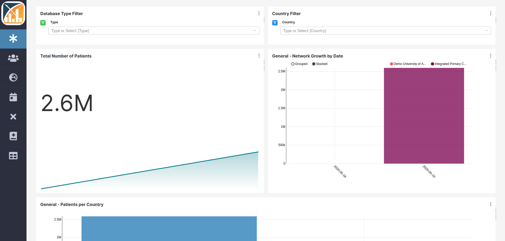

```{r setup, include=FALSE}
knitr::opts_chunk$set(echo = TRUE)
```

# Introduction

The OHDSI research network has been growing steadily which results in an increasing number of healthcare databases standardized to the OMOP CDM format. The OHDSI community created the ACHILLES tool (Automated Characterization of Health Information at Large-scale Longitudinal Exploration System) to characterize those databases. The results are available to the data custodian in their local ATLAS tool and helps them to gain insights in their data and helps in assessing the feasibility of a particular research questions.

ACHILLES was designed to extract the metadata from a single database, which by itself does not allow the comparison with the remaining databases in the network. However, we believe there is even more value in sharing this information with others to enable network research in a Data Network Dashboard.

<h2>Data Network Dashboard</h2>

The European Health Data and Evidence Network (EHDEN) project therefore designed a Data Network Dashboard tool, a web application to aggregate information from distributed OMOP CDM databases. It uses the ACHILLES results files to construct graphical dashboards and enables database comparison (Figure \@ref(fig:intro)). The tool is built on Apache Superset, which is an open-source enterprise-ready business intelligence web application that can provide powerful and fully customizable graphical representations of data. Achilles results can be uploaded through the EHDEN Database Catalogue using the dashboards plugin but can also be directly uploaded in the tool. Figure 1. Example of a dashboards tool presenting age and gender distributions (simulated data).

```{r intro, fig.cap="Example of a dashboards tool presenting the databases available in the network (simulated data)",echo=FALSE, out.width="100%"}

```

In this tools, we defined and implemented a series of charts and dashboards containing the most relevant information about the databases, such as:

- **General**: dashboards that shows the databases types per country, the distribution of data source types, the growth of the Network including the number of database and the number of patients in the databases over time;
- **Person**: representing the number of patients per country, age distribution at first observation, year of birth distribution and normalized gender distribution;
- **Population characteristics**: dashboard with the cumulative patient time, persons with continuous observation per month, and the start and end dates of those periods;
- **Visit**: chart to compare the number and type of visit occurrence records;
- **Death**: information about the number of death records by month, and the patient age at time of death;
- **Concepts**: bubble chart which shows the number of patients and records per concept over the databases;
- **Data domains**: heat map visualization of the major data domains in each database.
