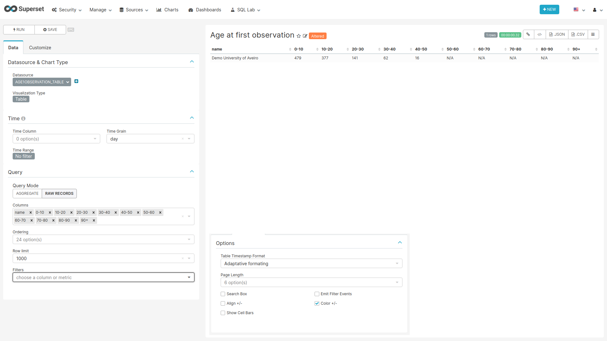
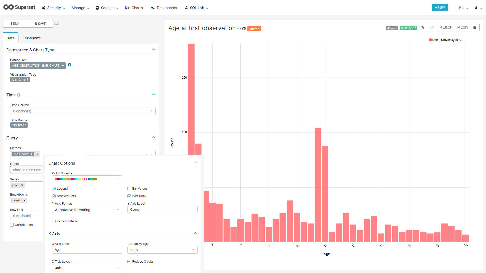
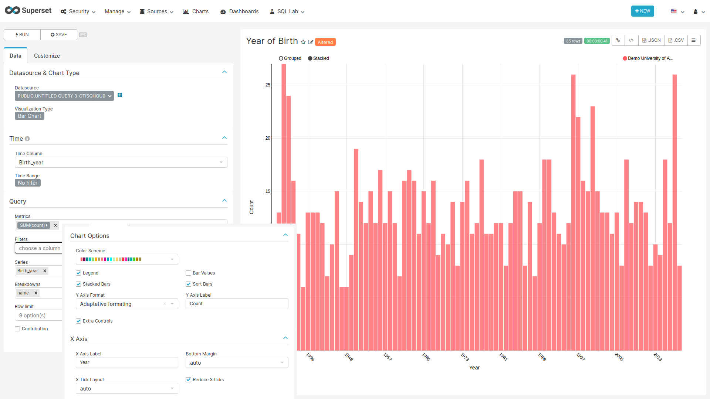
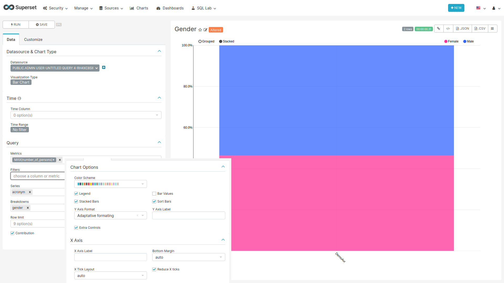

```{r setup, include=FALSE}
knitr::opts_chunk$set(echo = TRUE)
```

## Person

### Label Colors  {-}

In order to obtain the colors blue and rose in the chart representing the gender distribution,
add the following JSON entry to the JSON object of the `JSON Metadata` field on the edit dashboard page:

```json
"label_colors": {
    "Male": "#3366FF", 
    "Female": "#FF3399"
}
```

### CSS {-}

To hide the dashboard header insert the following css code to the `CSS` field on the edit page:

```css
.dashboard > div:not(.dashboard-content) {  /* dashboard header */
  display: none;
}
```

With this every time you want to edit the dashboard layout you have to either comment the CSS inserted
or remove it so the "Edit Dashboard" button can show again.

### Data Source Filter {-}

```{r dataSourceFilter, fig.cap="Settings for creating the Data Source filter chart",echo=FALSE, out.width="100%"}
knitr::include_graphics("images/shared/data_source_filter.png")
```

**For the filter to work the name of the fields to filter should match in all tables used on the charts of this dashboard.**

#### SQL query {-}

No SQL query, use the sql table `data_source` of the `achilles` database.

#### Chart settings {-}

- Data Tab
  - Datasource & Chart Type
    - Visualization Type: Filter Box
  - Time
    - Time range: No filter
  - Filters Configuration
    - Filters:
      - name
    - Date Filter: off
    - Instant Filtering: on

### Age at first observation - Table {#age1ObservationTable} {-}

```{r ageFirstObservationTable, fig.cap="Settings for creating the Age at First Observation Table chart",echo=FALSE, out.width="100%"}

```

#### SQL query {-}

```sql
SELECT source.name,
       source.acronym,
       SUM(CASE WHEN CAST(stratum_2 AS INTEGER) < 10 THEN count_value END) AS "0-10",
       SUM(CASE WHEN CAST(stratum_2 AS INTEGER) >= 10 AND CAST(stratum_2 AS INTEGER) < 20 THEN count_value END) AS "10-20",
       SUM(CASE WHEN CAST(stratum_2 AS INTEGER) >= 20 AND CAST(stratum_2 AS INTEGER) < 30 THEN count_value END) AS "20-30",
       SUM(CASE WHEN CAST(stratum_2 AS INTEGER) >= 30 AND CAST(stratum_2 AS INTEGER) < 40 THEN count_value END) AS "30-40",
       SUM(CASE WHEN CAST(stratum_2 AS INTEGER) >= 40 AND CAST(stratum_2 AS INTEGER) < 50 THEN count_value END) AS "40-50",
       SUM(CASE WHEN CAST(stratum_2 AS INTEGER) >= 50 AND CAST(stratum_2 AS INTEGER) < 60 THEN count_value END) AS "50-60",
       SUM(CASE WHEN CAST(stratum_2 AS INTEGER) >= 60 AND CAST(stratum_2 AS INTEGER) < 70 THEN count_value END) AS "60-70",
       SUM(CASE WHEN CAST(stratum_2 AS INTEGER) >= 70 AND CAST(stratum_2 AS INTEGER) < 80 THEN count_value END) AS "70-80",
       SUM(CASE WHEN CAST(stratum_2 AS INTEGER) >= 80 AND CAST(stratum_2 AS INTEGER) < 90 THEN count_value END) AS "80-90",
       SUM(CASE WHEN CAST(stratum_2 AS INTEGER) >= 90 THEN count_value END) AS "90+"
FROM public.achilles_results AS achilles
INNER JOIN public.data_source AS source ON achilles.data_source_id=source.id
INNER JOIN public.concept ON CAST(stratum_1 AS BIGINT) = concept_id
WHERE analysis_id = 102
GROUP BY name, acronym
```

#### Chart settings {-}
  
- Data Tab
  - Datasource & Chart Type
    - Visualization Type: Table
  - Time
    - Time range: No filter
  - Query
    - Query Mode: Raw Records
    - Columns: name, 0-10, 10-20, 20-30, 30-40, 40-50, 50-60, 60-70, 70-80, 80-90, 90+
- Customize Tab
  - Options
    - Show Cell Bars: off

### Age at first observation - Bars {#age1ObservationBars} {-}

```{r ageFirstObservationBar, fig.cap="Settings for creating the Age at First Observation Bar chart",echo=FALSE, out.width="100%"}

```

#### SQL query {-}

```sql
SELECT source.name,
    cast(stratum_1 AS int) AS Age,
    count_value AS count, 
    source.acronym
FROM public.achilles_results AS achilles
INNER JOIN public.data_source AS source ON achilles.data_source_id=source.id
WHERE analysis_id = 101
```

#### Chart settings {-}

- Data Tab
  - Datasource & Chart Type
    - Visualization Type: Bar Chart
  - Time
    - Time range: No filter
  - Query
    - Metrics: MAX(count)
    - Series: age
    - Breakdowns: name
- Customize Tab
  - Chart Options
    - Stacked Bars: on
    - Sort Bars: on
    - Y Axis Label: Count
  - X Axis
    - X Axis Label: Age
    - Reduce X ticks: on

### Year of Birth {#yearOfBirth} {-}

```{r yearOfBirth, fig.cap="Settings for creating the Year of Birth chart",echo=FALSE, out.width="100%"}

```

#### SQL query {-}

```sql
SELECT source.name,
       source.acronym,
       stratum_1 AS "Birth_year",
       count_value AS count
FROM public.achilles_results AS achilles
INNER JOIN public.data_source AS source ON achilles.data_source_id=source.id
WHERE analysis_id = 3
```

#### Chart settings {-}

- Data Tab
  - Datasource & Chart Type
    - Visualization Type: Bar Chart
  - Time
    - Time range: No filter
  - Query
    - Metrics: SUM(count)
    - Series: Birth_year
    - Breakdowns: name
- Customize Tab
  - Chart Options
    - Stacked Bars: on
    - Sort Bars: on
    - Y Axis Label: Count
    - Extra Controls: on
  - X Axis
    - X Axis Label: Year
    - Reduce X ticks: on


### Gender {-}

```{r gender, fig.cap="Settings for creating the Gender chart",echo=FALSE, out.width="100%"}

```

#### SQL query {-}

```sql
SELECT source.name,
       concept_name AS Gender, 
       count_value AS Number_of_persons,
       source.acronym
FROM public.achilles_results AS achilles
INNER JOIN public.data_source AS source ON achilles.data_source_id=source.id
JOIN (
  SELECT '8507' AS concept_id, 'Male' AS concept_name
  UNION
  SELECT '8532' AS concept_id, 'Female' AS concept_name
) AS concepts ON achilles.stratum_1 = concept_id
WHERE analysis_id = 2
```

#### Chart settings {-}

- Data Tab
  - Datasource & Chart Type
    - Visualization Type: Bar Chart
  - Time
    - Time range: No filter
  - Query
    - Metrics: MAX(Number_of_persons)
    - Series: acronym
    - Breakdowns: gender
    - Contribution: on
- Customize Tab
  - Chart Options
    - Stacked Bars: on
    - Sort Bars: on
    - Extra Controls: on
  - X Axis
    - Reduce X ticks: on
