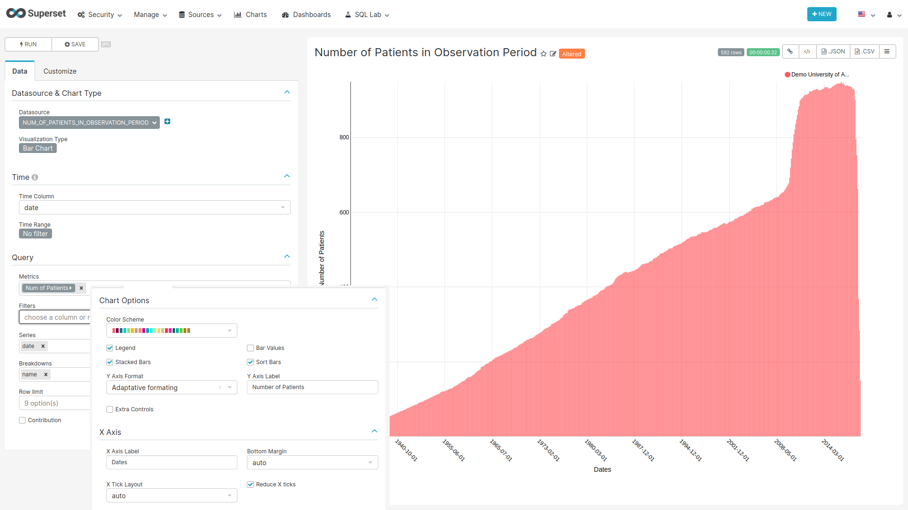
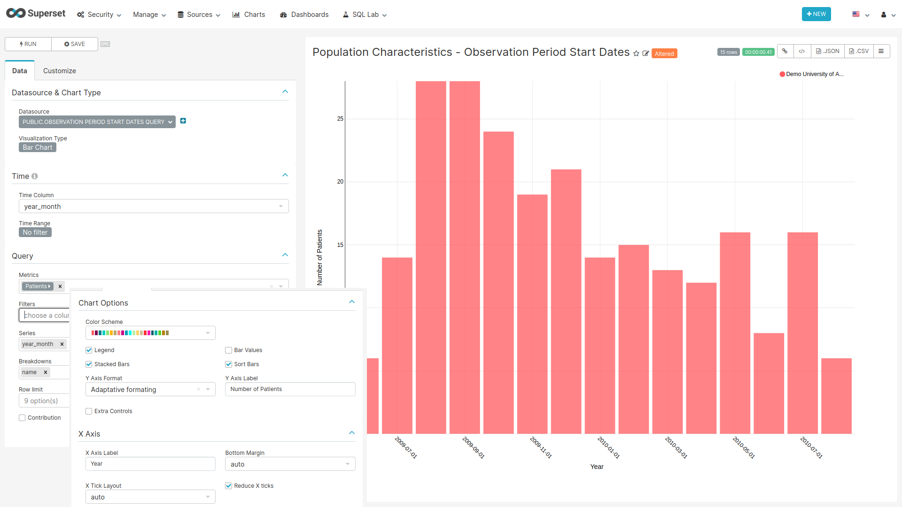
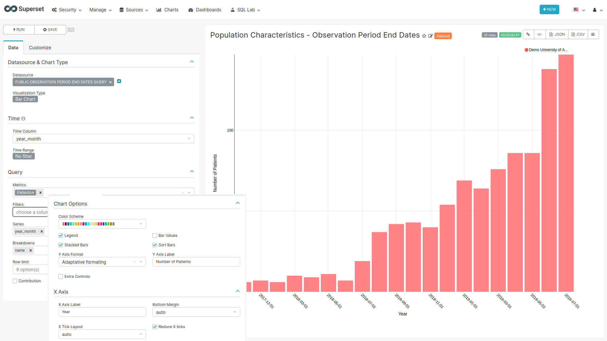

```{r setup, include=FALSE}
knitr::opts_chunk$set(echo = TRUE)
```

## Observation Period [Deprecated]

<!-- Discuss the goal of this dashboard... TO DO -->

### CSS {-}

To hide the dashboard header insert the following css code to the `CSS` field on the edit page:

```css
.dashboard > div:not(.dashboard-content) {  /* dashboard header */
  display: none;
}
```

With this every time you want to edit the dashboard layout you have to either comment the CSS inserted
or remove it so the "Edit Dashboard" button can show again.

### Data Source Filter {-}

```{r dataSourceFilter, fig.cap="Settings for creating the Data Source filter chart",echo=FALSE, out.width="100%"}
knitr::include_graphics("images/shared/data_source_filter.png")
```

**For the filter to work the name of the fields to filter should match in all tables used on the charts of this dashboard.**

#### SQL query {-}

No SQL query, use the sql table `data_source` of the `achilles` database.

#### Chart settings {-}

- Data Tab
  - Datasource & Chart Type
    - Visualization Type: Filter Box
  - Time
    - Time range: No filter
  - Filters Configuration
    - Filters:
      - name
    - Date Filter: off
    - Instant Filtering: on

### Number of Patients in Observation Period {-#numInObservationPeriod}

The Number of Patients in Observation Period plot shows the number of patients that contribute at least one day in a specific month.

```{r numPatientsInObserPeriod, fig.cap="Settings for creating the Number of Patients in Observation Period chart",echo=FALSE, out.width="100%"}

```

#### SQL query {-}

```sql
SELECT source.name,
       source.acronym,
       to_date(stratum_1, 'YYYYMM') as Date,
       count_value
FROM public.achilles_results AS achilles
INNER JOIN public.data_source AS source
  ON achilles.data_source_id=source.id
WHERE analysis_id = 110
```

#### Chart settings {-}

- Data Tab
  - Datasource & Chart Type
    - Visualization Type: Bar Chart
  - Time
    - Time range: No filter
  - Query
    - Metrics: MAX(count_value) with label "Num of Patients"
    - Series: date
    - Breakdowns: name
- Customize Tab
  - Chart Options
    - Stacked Bars: on
    - Sort Bars: on
    - Y Axis Label: Number of Patients
  - X Axis
    - X Axis Label: Dates
    - Reduce X ticks: on

### Observation Period Start Dates {-}

```{r observationPeriodStartDates, fig.cap="Settings for creating the Observation Period Start Dates chart",echo=FALSE, out.width="100%"}

```

#### SQL query {-}

```sql
SELECT source.name,
       source.acronym,
       to_date(stratum_1, 'YYYYMM') AS year_month,
       count_value
FROM public.achilles_results AS achilles
INNER JOIN public.data_source AS source
  ON achilles.data_source_id=source.id
WHERE analysis_id = 111
```

#### Chart settings {-}

- Data Tab
  - Datasource & Chart Type
    - Visualization Type: Bar Chart
  - Time
    - Time range: No filter
  - Query
    - Metrics: SUM(count_value) with label "Patients"
    - Series: year_month
    - Breakdowns: name
- Customize Tab
  - Chart Options
    - Stacked Bars: on
    - Sort Bars: on
    - Y Axis Label: Number of Patients
  - X Axis
    - X Axis Label: Year
    - Reduce X ticks: on

### Observation Period End Dates {-}

```{r observationPeriodEndDates, fig.cap="Settings for creating the Observation Period End Dates chart",echo=FALSE, out.width="100%"}

```

#### SQL query {-}

```sql
SELECT source.name,
       source.acronym,
       to_date(stratum_1, 'YYYYMM') AS year_month,
       count_value
FROM public.achilles_results AS achilles
INNER JOIN public.data_source AS source
  ON achilles.data_source_id=source.id
WHERE analysis_id = 112
```

#### Chart settings {-}

- Data Tab
  - Datasource & Chart Type
    - Visualization Type: Bar Chart
  - Time
    - Time range: No filter
  - Query
    - Metrics: SUM(count_value) with label "Patients"
    - Series: year_month
    - Breakdowns: name
- Customize Tab
  - Chart Options
    - Stacked Bars: on
    - Sort Bars: on
    - Y Axis Label: Number of Patients
  - X Axis
    - X Axis Label: Year
    - Reduce X ticks: on
