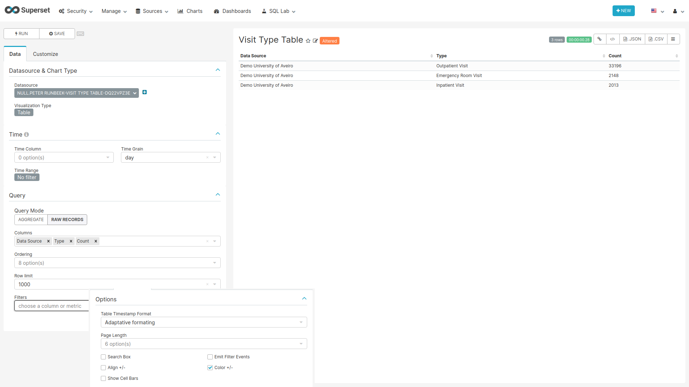
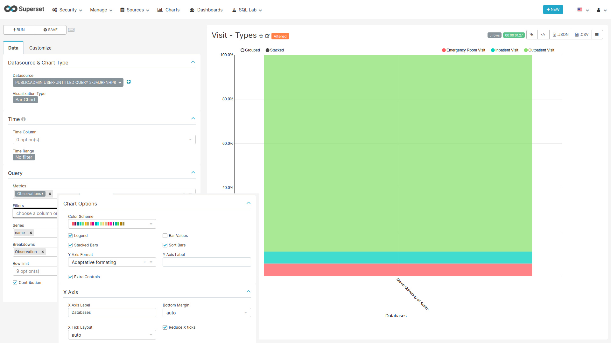

```{r setup, include=FALSE}
knitr::opts_chunk$set(echo = TRUE)
```

## Visit

<!-- Discuss the goal of this dashboard... TO DO -->

This dashboard shows the different types of visits per data source (see [Visit Occurence Table](https://ohdsi.github.io/CommonDataModel/cdm531.html#visit_occurrence))

### CSS {-}

To hide the dashboard header insert the following css code to the `CSS` field on the edit page:

```css
.dashboard > div:not(.dashboard-content) {  /* dashboard header */
  display: none;
}
```

With this every time you want to edit the dashboard layout you have to either comment the CSS inserted
or remove it so the "Edit Dashboard" button can show again.

### Data Source Filter {-}

```{r dataSourceFilter, fig.cap="Settings for creating the Data Source filter chart",echo=FALSE, out.width="100%"}
knitr::include_graphics("images/shared/data_source_filter.png")
```

**For the filter to work the name of the fields to filter should match in all tables used on the charts of this dashboard.**

#### SQL query {-}

No SQL query, use the sql table `data_source` of the `achilles` database.

#### Chart settings {-}

- Data Tab
  - Datasource & Chart Type
    - Visualization Type: Filter Box
  - Time
    - Time range: No filter
  - Filters Configuration
    - Filters:
      - name
    - Date Filter: off
    - Instant Filtering: on

### Visit Type Table {#visitTypeTable} {-}

```{r visitTypeTable, fig.cap="Settings for creating the Visit Type Table chart",echo=FALSE, out.width="100%"}

```

#### SQL query {-}

```sql
SELECT source.name,
       source.acronym,
       concept_name AS "Type",
       MAX(count_value) AS "Count"
FROM public.achilles_results AS achilles
INNER JOIN public.data_source AS source ON achilles.data_source_id=source.id
INNER JOIN public.concept ON CAST(stratum_1 AS BIGINT) = concept_id
WHERE analysis_id = 201
GROUP BY name, acronym, "Type"
ORDER BY "Count" DESC
```

#### Chart settings {-}

- Data Tab
  - Datasource & Chart Type
    - Visualization Type: Table
  - Time
    - Time range: No filter
  - Query
    - Query Mode: Raw Records
    - Columns: name with label "Data Source", Type, Count

### Visit Types Bars {-}

```{r visitTypeBars, fig.cap="Settings for creating the Visit Types bar chart",echo=FALSE, out.width="100%"}

```

#### SQL query {-}

```sql
SELECT source.name, 
       source.acronym,
       concept_name AS "Observation", 
       count_value
FROM public.achilles_results AS achilles 
INNER JOIN public.data_source AS source ON achilles.data_source_id=source.id
INNER JOIN public.concept ON CAST(stratum_1 AS BIGINT) = concept_id
WHERE analysis_id = 201
```

#### Chart settings {-}

- Data Tab
  - Datasource & Chart Type
    - Visualization Type: Bar Chart
  - Time
    - Time range: No filter
  - Query
    - Metrics: MAX(count_value) with label Observations
    - Series: name
    - Breakdowns: Observation
- Customize Tab
  - Chart Options
    - Stacked Bars: on
    - Sort Bars: on
    - Extra Controls: on
  - X Axis
    - X Axis Label: Databases
    - Reduce X ticks: on
