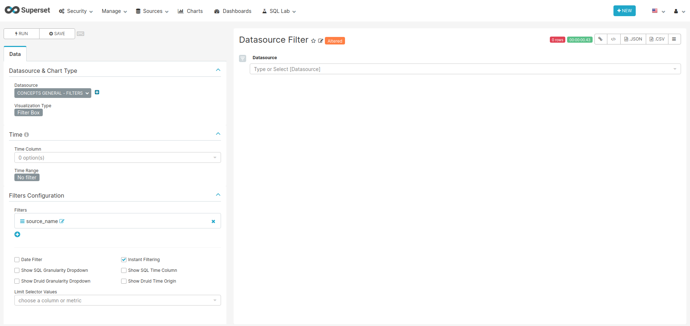
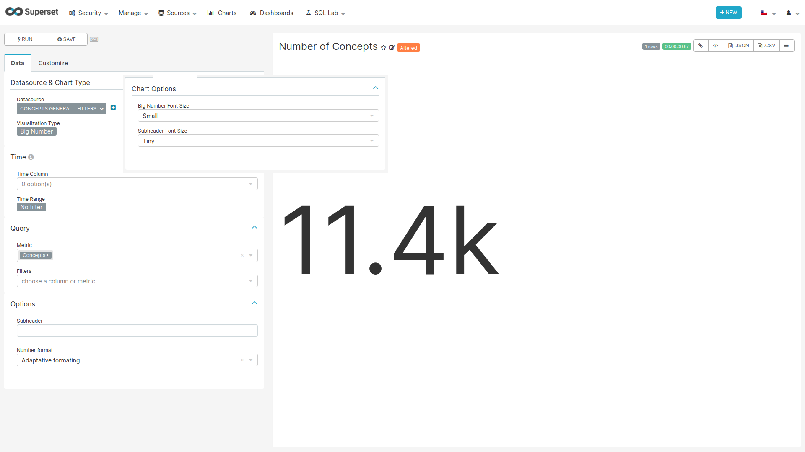
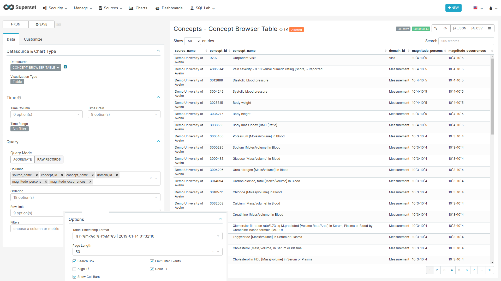

```{r setup, include=FALSE}
knitr::opts_chunk$set(echo = TRUE)
```

## Concepts Browser [Deprecated]

The concepts browser allows you to search for concepts by name or concept_id in all the data sources you select. No exact number of patients or occurrences are provided but the magnitude of both.

### CSS {-}

To hide the dashboard header insert the following css code to the `CSS` field on the edit page:

```css
.dashboard > div:not(.dashboard-content) {  /* dashboard header */
  display: none;
}
```

With this every time you want to edit the dashboard layout you have to either comment the CSS inserted
or remove it so the "Edit Dashboard" button can show again.

### Data Source and Domain Filters {-}

```{r filters, fig.cap="Settings for creating the Data Source and Domain filter charts",echo=FALSE, out.width="100%"}

```

**For the filters to work the name of the fields to filter should match in all tables used on the charts of this dashboard.**

#### SQL query {-}
           
```sql
SELECT concept_name,
     domain_id,
     source.name AS source_name,
     source.acronym
FROM achilles_results JOIN concept
  ON cast(stratum_1 AS BIGINT) = concept_id
INNER JOIN public.data_source AS source
  ON data_source_id=source.id
WHERE
  analysis_id in (
    201, 401, 601, 701, 801, 901, 1001, 1801,
    200, 400, 600, 700, 800, 1800
  )
```

#### Chart settings {-}

- Data Tab
  - Datasource & Chart Type
    - Visualization Type: Filter Box
  - Time
    - Time range: No filter
  - Filters Configuration
    - Filters:
      - source_name or domain_id
    - Date Filter: off
    - Instant Filtering: on


### Number of Concepts {-}

```{r numOfConcepts, fig.cap="Settings for creating the Number of Concepts chart",echo=FALSE, out.width="100%"}

```

#### SQL Query {-}

Same as [Data Source and Domain filters](#Data Source and Domain Filters) query

#### Chart settings {-}

- Data Tab
  - Datasource & Chart Type
    - Visualization Type: Big Number
  - Time
    Time range: No filter
  - Query
    - Metric: COUNT_DISTINCT(concept_name) with label Concepts
- Customize Tab
  - Big Number Font Size: Small
  - Subheader Font Size: Tiny

### Concept Browser Table {#conceptBrowserTable} {-}

```{r conceptsTable, fig.cap="Settings for creating the Concepts Table chart",echo=FALSE, out.width="100%"}

```

```sql
SELECT
    q1.concept_id AS concept_id,
    q1.concept_name AS concept_name,
    q1.domain_id,
    source.name AS source_name,
    source.acronym,
    sum(q1.count_value) as "Occurrence_count",
    sum(q1.count_person) as "Person_count",
    CASE 
        WHEN sum(q1.count_value)<=10
          THEN '<=10'
        WHEN sum(q1.count_value)<=100
          THEN '11-10ˆ2'
        WHEN sum(q1.count_value)<=1000
          THEN '10ˆ2-10ˆ3'
        WHEN sum(q1.count_value)<=10000
          THEN '10ˆ3-10ˆ4'
        WHEN sum(q1.count_value)<=100000
          THEN '10ˆ4-10ˆ5'
        WHEN sum(q1.count_value)<=1000000
          THEN '10ˆ5-10ˆ6'
        ELSE '>10ˆ6'
    END as "magnitude_occurrences",
    CASE 
        WHEN sum(q1.count_person)<=10
          THEN '<=10'
        WHEN sum(q1.count_person)<=100
          THEN '11-10ˆ2'
        WHEN sum(q1.count_person)<=1000
          THEN '10ˆ2-10ˆ3'
        WHEN sum(q1.count_person)<=10000
          THEN '10ˆ3-10ˆ4'
        WHEN sum(q1.count_person)<=100000
          THEN '10ˆ4-10ˆ5'
        WHEN sum(q1.count_person)<=1000000
          THEN '10ˆ5-10ˆ6'
        ELSE '>10ˆ6'
    END AS "magnitude_persons"
FROM (SELECT analysis_id,
             stratum_1 concept_id,
             data_source_id,
             concept_name,
             domain_id,
             count_value, 0 as count_person
    FROM achilles_results
    JOIN concept
      ON cast(stratum_1 AS BIGINT)=concept_id
    WHERE
      analysis_id in (
        201, 301, 401, 601, 701, 801, 901, 1001,
        1801
      )
    UNION (SELECT  analysis_id,
                   stratum_1 concept_id,
                   data_source_id,
                   concept_name,
                   domain_id,
                   0 as count_value,
                   sum(count_value) as count_person
            FROM  achilles_results
            JOIN concept
              ON cast(stratum_1 as BIGINT)=concept_id
            WHERE
              analysis_id in (
                202, 401, 601, 701, 801, 901, 1001, 1801
              )
            GROUP BY
              analysis_id,
              stratum_1,
              data_source_id,
              concept_name,
              domain_id
            )) as q1
    INNER JOIN public.data_source AS source
      ON q1.data_source_id=source.id
GROUP BY
  q1.concept_id,
  q1.concept_name,
  q1.domain_id,
  source.name,
  acronym
ORDER BY "Person_count" desc
```

#### Chart settings {-}

- Data Tab
  - Datasource & Chart Type
    - Visualization Type: Table
  - Time
    - Time range: No filter
  - Query
    - Query Mode: Raw Records
    - Columns: source_name, concept_id, concept_name, domain_id, magnitude_persons, magnitude_occurrences
- Customize Tab
  - Options
    - Table Timestamps Format: %Y-%m-%d %H:%M:%S | 2019-01-14 01:32:10
    - Page Length: 50
    - Search Box: on
    - Emit Filter Events: on
