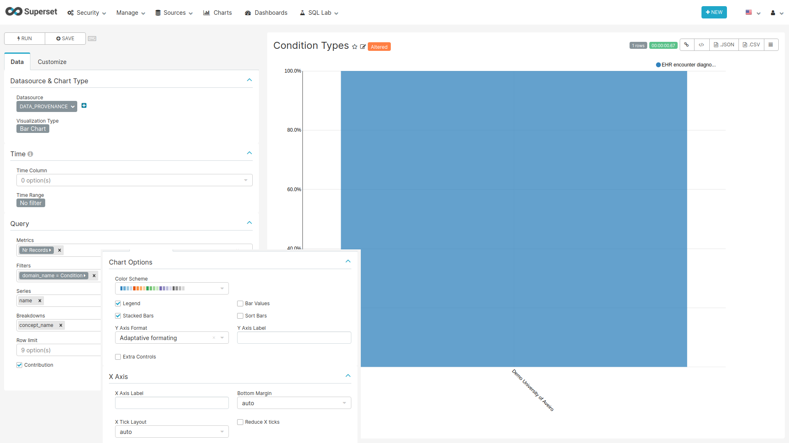

```{r setup, include=FALSE}
knitr::opts_chunk$set(echo = TRUE)
```

## Provenance

This Dashboard shows the provenance of the data in the different data domains.

### CSS {-}

To hide the dashboard header insert the following css code to the `CSS` field on the edit page:

```css
.dashboard > div:not(.dashboard-content) {  /* dashboard header */
  display: none;
}
```

With this every time you want to edit the dashboard layout you have to either comment the CSS inserted
or remove it so the "Edit Dashboard" button can show again.

### Data Source Filter {-}

```{r dataSourceFilter, fig.cap="Settings for creating the Data Source filter chart",echo=FALSE, out.width="100%"}
knitr::include_graphics("images/shared/data_source_filter.png")
```

**For the filter to work the name of the fields to filter should match in all tables used on the charts of this dashboard.**

#### SQL query {-}

No SQL query, use the sql table `data_source` of the `achilles` database.

#### Chart settings {-}

- Data Tab
  - Datasource & Chart Type
    - Visualization Type: Filter Box
  - Time
    - Time range: No filter
  - Filters Configuration
    - Filters:
      - name
    - Date Filter: off
    - Instant Filtering: on

### Condition & Drug & Procedure & Device & Measurement & Observation Types {#dataProvenanceCharts} {-}

```{r conditionDrugProcedureDeviceMeasurementObservationTypes, fig.cap="Settings for creating the Condition, Drug, Procedure, Device, Measurement and Observation charts",echo=FALSE, out.width="100%"}

```

#### SQL query {-}

All 6 charts use the same sql query.
           
```sql
SELECT source.name,
    source.acronym,
    CASE WHEN analysis_id = 405 THEN 'Condition'
    WHEN analysis_id = 605 THEN 'Procedure'
    WHEN analysis_id = 705 THEN 'Drug'
    WHEN analysis_id = 805 THEN 'Observation'
    WHEN analysis_id = 1805 THEN 'Measurement'
    WHEN analysis_id = 2105 THEN 'Device'
    ELSE 'Other' END AS domain_name,
    concept_name,
    SUM(count_value) AS num_records
FROM public.achilles_results AS achilles
INNER JOIN public.data_source AS source ON achilles.data_source_id=source.id
INNER JOIN public.concept AS c1 ON CAST(stratum_2 AS BIGINT) = concept_id
WHERE analysis_id IN (405,605,705,805,1805,2105)
GROUP BY source.name, source.acronym, concept_name, 
    CASE WHEN analysis_id = 405 THEN 'Condition'
    WHEN analysis_id = 605 THEN 'Procedure'
    WHEN analysis_id = 705 THEN 'Drug'
    WHEN analysis_id = 805 THEN 'Observation'
    WHEN analysis_id = 1805 THEN 'Measurement'
    WHEN analysis_id = 2105 THEN 'Device'
    ELSE 'Other' END
```

#### Chart settings {-}

- Data Tab
  - Datasource & Chart Type
    - Visualization Type: Bar Chart
  - Time
    - Time range: No filter
  - Query
    - Metrics: SUM(num_records) with label Nr Records
    - Filters: domain_name=Condition or domain_name=Drug or domain_name=Procedure or domain_name=Device or domain_name=Measurement or domain_name=Observation
    - Series: name
    - Breakdowns: concept_name
    - Contribution: on
- Customize Tab
  - Chart Options
    - Stacked Bars: on
