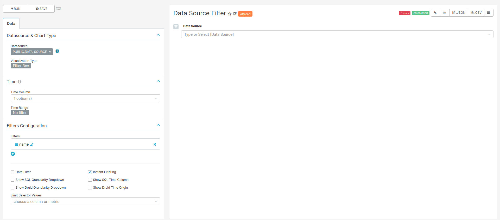
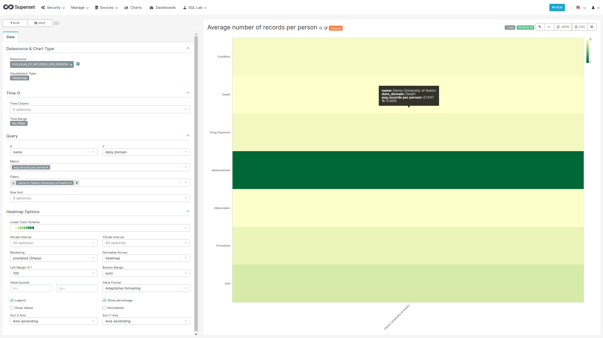

```{r setup, include=FALSE}
knitr::opts_chunk$set(echo = TRUE)
```

# Data Domains

<!-- Discuss the goal of this dashboard... TO DO -->

## CSS

To hide the dashboard header insert the following css code to the `CSS` field on the edit page:

```css
.dashboard > div:not(.dashboard-content) {  /* dashboard header */
  display: none;
}
```

With this every time you want to edit the dashboard layout you have to either comment the CSS inserted
or remove it so the "Edit Dashboard" button can show again.

## Data Source Filter

```{r dataSourceFilter, fig.cap="Settings for creating the Data Source filter chart",echo=FALSE, out.width="100%"}

```

**For the filter to work the name of the fields to filter should match in all tables used on the charts of this dashboard.**

### SQL query

No SQL query, use the sql table `data_source` of the `achilles` database.

### Chart settings

- Data Tab
  - Datasource & Chart Type
    - Visualization Type: Filter Box
  - Time
    - Time range: No filter
  - Filters Configuration
    - Filters:
      - name
    - Date Filter: off
    - Instant Filtering: on

## Average Number of Records per Person {#avgRecordsPerPerson}

```{r , fig.cap="Settings for creating the Data Source filter chart",echo=FALSE, out.width="100%"}

```

### SQL query

```sql
SELECT 
    source.name,
    source.acronym,
    CASE 
    WHEN analysis_id = 201 THEN 'Visit'
    WHEN analysis_id = 401 THEN 'Condition'
    WHEN analysis_id = 501 THEN 'Death'
    WHEN analysis_id = 601 THEN 'Procedure'
    WHEN analysis_id = 701 THEN 'Drug Exposure'
    WHEN analysis_id = 801 THEN 'Observation'
    WHEN analysis_id = 1801 THEN 'Measurement'
    WHEN analysis_id = 2101 THEN 'Device'
    WHEN analysis_id = 2201 THEN 'Note'
    END AS Data_Domain,
    SUM(count_value) /AVG(num_persons) AS "records_per_person"
FROM public.achilles_results AS achilles
INNER JOIN public.data_source AS source ON achilles.data_source_id=source.id
INNER JOIN (
  SELECT data_source_id , count_value as num_persons
  FROM achilles_results
  WHERE analysis_id = 1) counts ON achilles.data_source_id = counts.data_source_id 
GROUP BY analysis_id, source.name, source.acronym
HAVING analysis_id IN (201, 401, 501, 601, 701, 801, 1801, 2101, 2201)
```

### Chart settings

- Data Tab
  - Datasource & Chart Type
    - Visualization Type: Heatmap
  - Time
    - Time range: No filter
  - Query
    - X: name
    - Y: data_domain
    - Metric: AVG(records_per_person) with a label avg records per person
    - Row limit: None
  - Heatmap Options
    - Left Margin: 100
    - Show Percentage: off