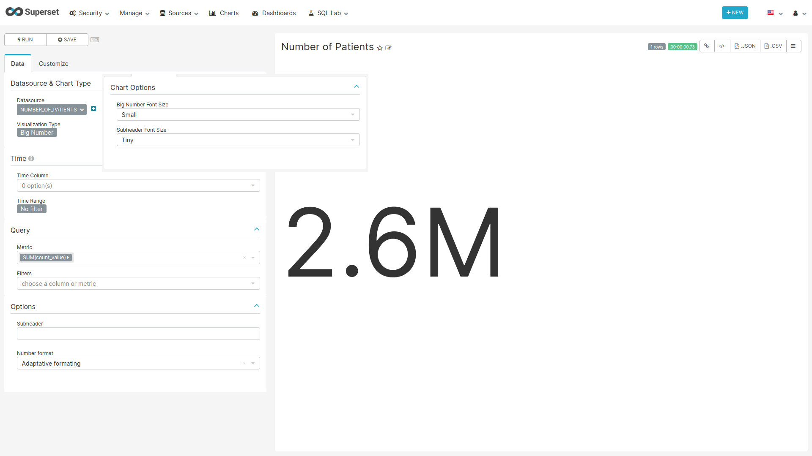
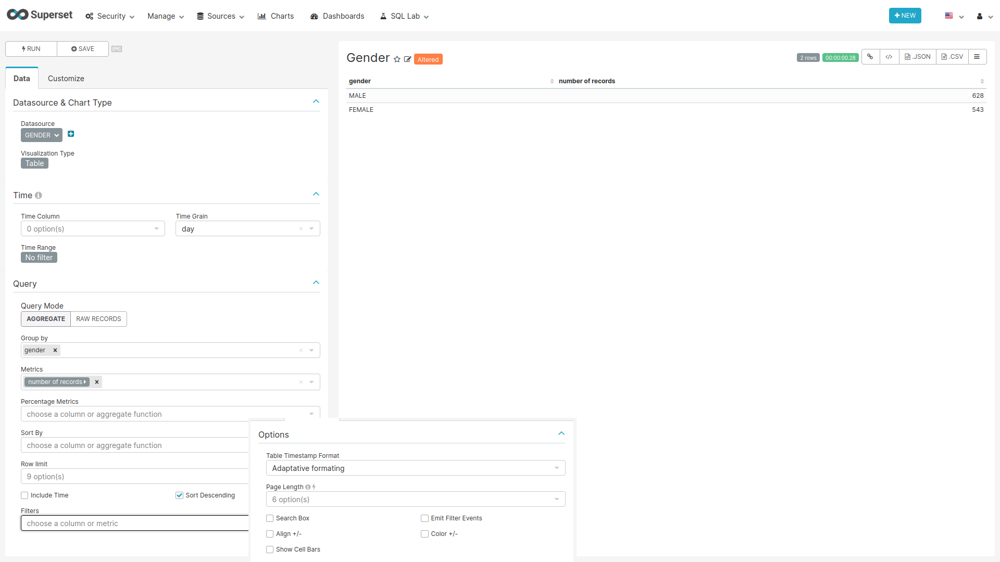
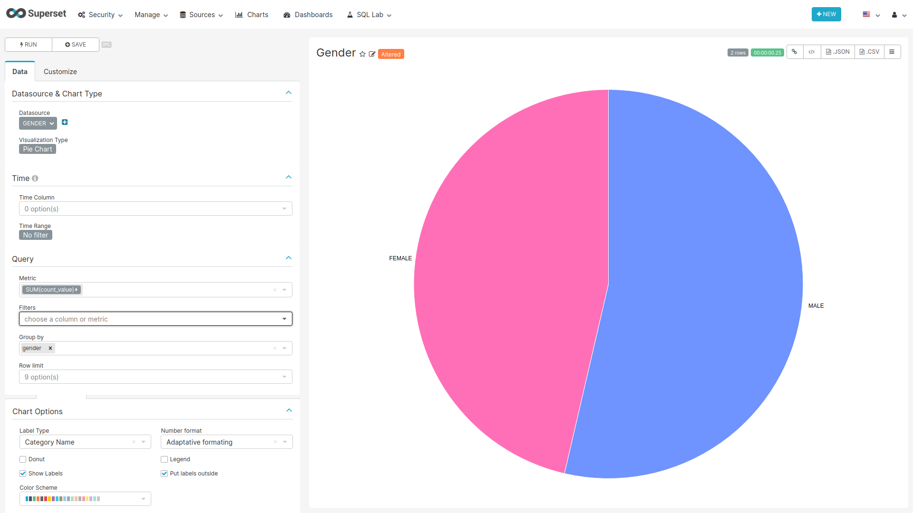
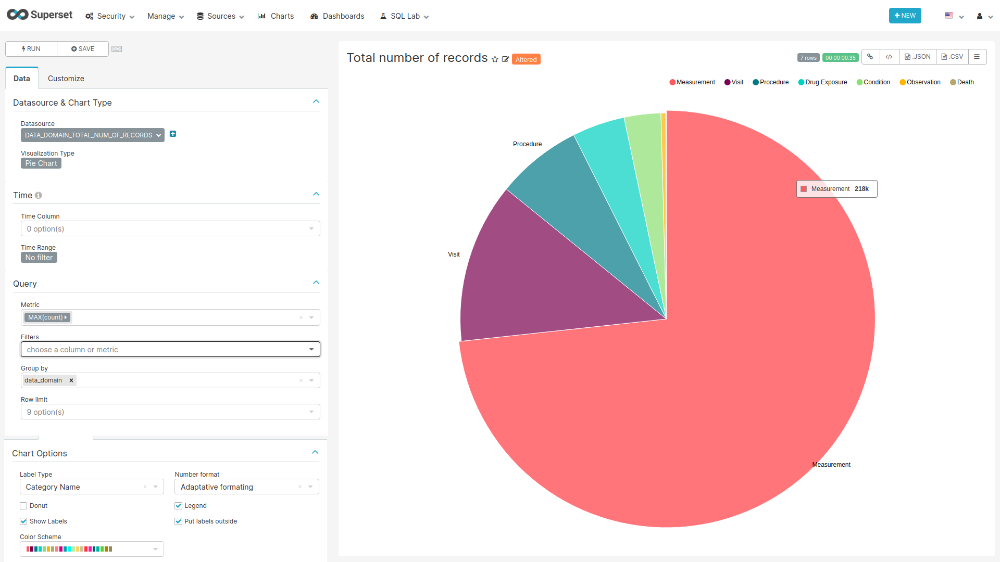
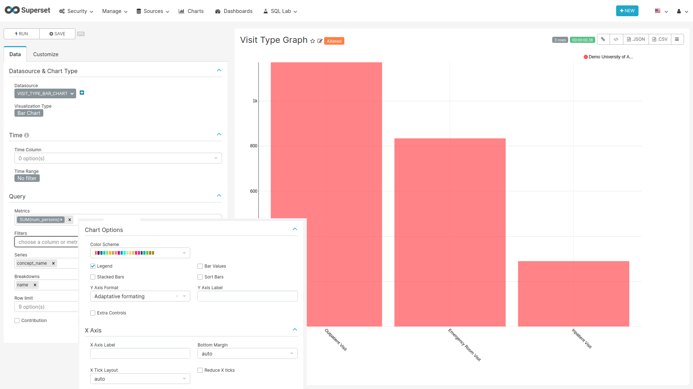
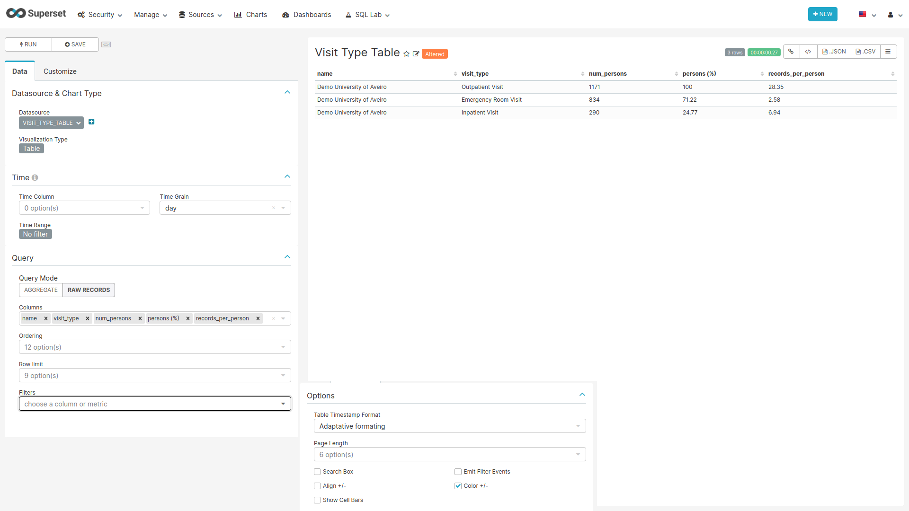

```{r setup, include=FALSE}
knitr::opts_chunk$set(echo = TRUE)
```

# Per Database {#PerDatabaseDashboard}

<!-- Discuss the goal of this dashboard... TO DO -->

## Label Colors 

In order to obtain the colors blue and rose in the chart representing the gender distribution,
add the following JSON entry to the JSON object of the `JSON Metadata` field on the edit dashboard page:

```json
"label_colors": {
    "Male": "#3366FF", 
    "Female": "#FF3399"
}
```

## CSS

To hide the dashboard header insert the following css code to the `CSS` field on the edit page:

```css
.dashboard > div:not(.dashboard-content) {  /* dashboard header */
  display: none;
}
```

With this every time you want to edit the dashboard layout you have to either comment the CSS inserted
or remove it so the "Edit Dashboard" button can show again.

## Data Source Filter

```{r dataSourceFilter, fig.cap="Settings for creating the Data Source filter chart",echo=FALSE, out.width="100%"}
knitr::include_graphics("images/shared/data_source_filter.png")
```

**For the filter to work the name of the fields to filter should match in all tables used on the charts of this dashboard.**

### SQL query

No SQL query, use the sql table `data_source` of the `achilles` database.

### Chart settings

- Data Tab
  - Datasource & Chart Type
    - Visualization Type: Filter Box
  - Time
    - Time range: No filter
  - Filters Configuration
    - Filters:
      - name
    - Date Filter: off
    - Instant Filtering: on

## Demographics Tab

### Number of Patients

```{r numPatients, fig.cap="Settings for creating the Number of Patients chart",echo=FALSE, out.width="100%"}

```

#### SQL query

```sql
SELECT
  achilles_results.count_value,
  data_source.name,
  data_source.acronym
FROM achilles_results
JOIN data_source ON achilles_results.data_source_id=data_source.id
WHERE analysis_id = 1
```

#### Chart settings

- Data Tab
  - Datasource & Chart Type
    - Visualization Type: Big Number
  - Time
    Time range: No filter
  - Query
    - Metric: sum(count_value)
- Customize Tab
  - Big Number Font Size: Small
  - Subheader Font Size: Tiny

### Gender Table

```{r genderTable, fig.cap="Settings for creating the Gender Table chart",echo=FALSE, out.width="100%"}

```

#### SQL Query {#genderTableQuery}

```sql
SELECT source.name as name,
       source.acronym,
       concept_name as gender,
       count_value
FROM public.achilles_results AS achilles
INNER JOIN public.data_source AS source ON achilles.data_source_id=source.id
INNER JOIN public.concept ON CAST(stratum_1 AS BIGINT) = concept_id
WHERE analysis_id = 2
```

#### Chart settings

- Data Tab
  - Datasource & Chart Type
    - Visualization Type: Table
  - Time
    - Time range: No filter
  - Query
    - Query Mode: Aggregate
    - Group by: gender
    - Metrics: SUM(count_value) with label number of records
    - Row lmit: None
- Customize Tab
  - Options
    - Show Cells Bars: off

### Gender Pie

```{r genderPie, fig.cap="Settings for creating the Gender Pie chart",echo=FALSE, out.width="100%"}

```

#### SQL query

Same as [Gender Table](#genderTableQuery) query

#### Chart settings

- Data Tab
  - Datasource & Chart Type
    - Visualization Type: Pie Chart
  - Time
    - Time range: No filter
  - Query
    - Metric: SUM(count_value)
    - Group by: gender
    - Row limit: None
- Customize Tab
  - Chart Options
    - Legend: off


### Age at first observation - Table

Same chart as the one used on the [Person](#age1ObservationTable) dashboard.

### Age at first observation - Bars

Same chart as the one used on the [Person](#age1ObservationBars) dashboard.

### Year of Birth

Same chart as the one used on the [Person](#yearOfBirth) dashboard.

## Data Domains Tab

### Average Number of Records per Person

Same chart as the one used on the [Data Domains](#avgRecordsPerPerson) dashboard.

### Total Number of Records

```{r totalNumRecords, fig.cap="Settings for creating the Total Number of Records chart",echo=FALSE, out.width="100%"}

```

#### SQL query

```sql
SELECT
data_source.name,
data_source.acronym,
    CASE 
    WHEN analysis_id = 201 THEN 'Visit'
    WHEN analysis_id = 401 THEN 'Condition'
    WHEN analysis_id = 501 THEN 'Death'
    WHEN analysis_id = 601 THEN 'Procedure'
    WHEN analysis_id = 701 THEN 'Drug Exposure'
    WHEN analysis_id = 801 THEN 'Observation'
    WHEN analysis_id = 1801 THEN 'Measurement'
    WHEN analysis_id = 2101 THEN 'Device'
    WHEN analysis_id = 2201 THEN 'Note'
    END AS Data_Domain,
    SUM(count_value) AS "count"
FROM achilles_results
JOIN data_source ON achilles_results.data_source_id=data_source.id
GROUP BY name, acronym, analysis_id
HAVING analysis_id IN (201, 401, 501, 601, 701, 801, 1801, 2101, 2201)
```

#### Chart settings

- Data Tab
  - Datasource & Chart Type
    - Visualization Type: Pie Chart
  - Time
    - Time range: No filter
  - Query
    - Metric: MAX(count)
    - Group by: data_domain
    - Row limit: None

## Data Provenance Tab

Same six charts used on the [Provenance](#dataProvenanceCharts) dashboard.

## Observation Period Tab

### Number of Patitents in Observation Period

Same chart used on the [Observation Period](#numInObservationPeriod) dashboard.

### Cumulative Observation Period

The cumulative observation time plot shows the percentage of patients that have more that X days of observation time.

```{r cumObservationTime, fig.cap="Settings for creating the Total Number of Records chart",echo=FALSE, out.width="100%"}
knitr::include_graphics("images/11-per_database/04-observation_period/02-cum_observation_period.png")
```

#### SQL Query

```sql
SELECT
  name,
  acronym,
  xLengthOfObservation,
  round(cumulative_sum / total, 5) as yPercentPersons
FROM (
  SELECT data_source_id, CAST(stratum_1 AS INTEGER) * 30 AS xLengthOfObservation, SUM(count_value) OVER (PARTITION BY data_source_id ORDER BY CAST(stratum_1 AS INTEGER) DESC) as cumulative_sum
  FROM achilles_results
  WHERE analysis_id = 108
) AS cumulative_sums
JOIN (
  SELECT data_source_id, count_value as total
  FROM achilles_results
  WHERE analysis_id = 1
) AS totals
ON cumulative_sums.data_source_id = totals.data_source_id
JOIN data_source ON cumulative_sums.data_source_id = data_source.id
ORDER BY name, xLengthOfObservation
```

#### Chart settings

- Data Tab
  - Datasource & Chart Type
    - Visualization Type: Bar Chart
  - Time
    - Time range: No filter
  - Query
    - Metrics: SUM(ypercentpersons)
    - Series: xlengthofobservation
    - Breakdowns: name
    - Row limit: None
- Customize Tab
  - Chart Options
    - Sort Bars: on
    - Y Axis Fomat: ,.1% (12345.432 => 1,234,543.2%)
    - Y Axis Label: Number of Patients
  - X Axis
    - X Axis Label: Days
    - Reduce X ticks: on

## Visit Tab

### Visit Type Graph

```{r visitTypeGraph, fig.cap="Settings for creating the Visit Type Graph chart",echo=FALSE, out.width="100%"}

```

#### SQL Query

```sql
SELECT
  data_source.name,
  data_source.acronym,
  concept.concept_name,
  achilles_results.count_value AS num_persons
FROM (SELECT * FROM achilles_results WHERE analysis_id = 200) AS achilles_results
JOIN data_source ON achilles_results.data_source_id = data_source.id
JOIN concept ON CAST(achilles_results.stratum_1 AS BIGINT) = concept.concept_id
```

#### Chart settings

- Data Tab
  - Datasource & Chart Type
    - Visualization Type: Bar Chart
  - Time
    - Time range: No filter
  - Query
    - Metrics: SUM(num_persons)
    - Series: concept_name
    - Breakdowns: name
    - Row limit: None

### Visit Type Table

```{r visitTypeTable, fig.cap="Settings for creating the Visit Type Table chart",echo=FALSE, out.width="100%"}

```

#### SQL Query

```sql
SELECT
  name,
  acronym,
  concept.concept_name,
  ar1.count_value AS num_persons,
  round(100.0 * ar1.count_value / denom.count_value, 2) AS percent_persons,
  round(1.0 * ar2.count_value / ar1.count_value, 2) AS records_per_person
FROM (
  SELECT *
  FROM achilles_results WHERE analysis_id = 200) AS ar1
  JOIN (
    SELECT *
    FROM achilles_results WHERE analysis_id = 201) AS ar2
    ON ar1.stratum_1 = ar2.stratum_1 AND ar1.data_source_id = ar2.data_source_id
  JOIN (
    SELECT *
    FROM achilles_results WHERE analysis_id = 1) AS denom
    ON ar1.data_source_id = denom.data_source_id
  JOIN data_source ON data_source.id = ar1.data_source_id
  JOIN concept ON CAST(ar1.stratum_1 AS INTEGER) = concept_id
ORDER BY ar1.data_source_id, ar1.count_value DESC
```

#### Chart Settings

- Data Tab
  - Datasource & Chart Type
    - Visualization Type: Table
  - Time
    - Time range: No filter
  - Query
    - Query Mode: Raw Records
    - Columns: name, visit_type, num_persons, percent_persons with label persons (%), records_per_person
    - Row limit: None
- Customize Tab
  - Options
    - Show Cell Bars: off

## Concept Browser Tab

### Concept Browser Table

Same chart used on the [Concept Browser](#conceptBrowserTable) dashboard.

## Meta Data Tab

### Meta Data Table

Same chart used on the [General](#metaDataTable) dashboard.