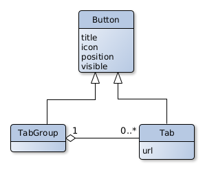

# Code Documentation

### Apps {-}

<h4>Materialized Queries Manager</h4>

<h5>Models</h5>

This app has only one model, MaterializedQuery, which maps to a Postgres materialized view.
To avoid having to maintain the consistency between both the records of this Django app and the Postgres materialized views:

- the managed Meta flag was set to `False` to avoid Django creating migrations to the model
- the db_table Meta flag was set to the name of the table where Postgres stores the information about the existing materialized views (`pg_matviews`).
- the fields of the model, matviewname and definition, use the same name and type as the ones of the `pg_matviews` Postgres table.

<h5>Views</h5>
This app has no view exposed since all operations to the MaterializedQuery models are expected to be performed in the Django admin app.

However, we had to change Django's default behaviors for the create, update and delete operations of the model.
For the delete operation, we overrode the delete method of the MaterializedQuery Django model to just execute a `DROP MATERIALIZED VIEW` SQL statement.
Related to creation and update we had to change some internal methods of Django's admin app ModelAdmin base class.

1. [_changeform_view](https://github.com/django/django/blob/3.2.5/django/contrib/admin/options.py#L1542): where Model records were being created.
   Instead, `CREATE MATERIALIZED VIEW` and `ALTER MATERIALIZED VIEW` SQL statements are executed.
   However, since some materialized views might take some time to build, create a record like this could lead to a browser timeout.
   We then decided to execute these statements in a celery background task.
   The main changes were made [here](https://github.com/EHDEN/NetworkDashboards/blob/master/dashboard_viewer/materialized_queries_manager/admin.py#L87-L92) where we launch the background task.
2. [response_add](https://github.com/django/django/blob/3.2.5/django/contrib/admin/options.py#L1176): Since the materialized view might not be created the right way, saying "A record was created successfully" is not adequate.
   We then [changed the message](https://github.com/EHDEN/NetworkDashboards/blob/master/dashboard_viewer/materialized_queries_manager/admin.py#L177-L183) that is presented after the creation to tell in the id of the background task that is creating the materialized query.
   The result of the query can then be consulted on the associated Task Results record on the Celery Results section app of the Django admin console.
3. [response_change](https://github.com/django/django/blob/3.2.5/django/contrib/admin/options.py#L1253): changes [here](https://github.com/EHDEN/NetworkDashboards/blob/master/dashboard_viewer/materialized_queries_manager/admin.py#L213-L219) with the same ideas behind as response_add.

If any catalogue results files are being uploaded to the platform, any worker attempting to create or change a materialized view will block until such data is uploaded.
Also if any worker is creating materialized views, no other worker can upload catalogue results data.

Through the admin console, there is also the possibility to refresh a specific MaterializedQuery.
To do so, on the list view, select the MaterializedQueries to refresh, then on the actions dropdown select "Refresh selected materialized queries".
Once again to avoid timeouts, such operations are executed on a background task.

<h4>Tabs Manager</h4>

Currently, this app is not being used and the URL mapping was delete.
To use it again uncomment the tabsManager [line](https://github.com/EHDEN/NetworkDashboards/blob/master/dashboard_viewer/dashboard_viewer/urls.py#L29) on the dashboard_viewer/dashboard_viewer/urls.py file.
Then you can access the tabs page through the `[BASE_RUL]/tabs/` URL.

<h5>Views</h5>

On this app, there is only one view.
It is a simple page with just a sidebar to choose which dashboard to displays on an iframe.
Besides the simplicity, all the animations around the sidebar buttons are handled by CSS with some JS that adds and removes classes to HTML elements, as events (hover and click) happen.
To facilitate the development process of CSS, [SCSS](https://sass-lang.com/) was used to build styling of the view.
It prevents duplication with the addition of variables and adds the possibility to express parent classes by nesting their declaration.

In cases where there are a lot of buttons on the sidebar, some buttons might get impossible to reach since they are out of the field of view.
To avoid this we make use of [SimpleBar](https://github.com/Grsmto/simplebar), which makes the sidebar scrollable, displaying a scroll bar on the right side of the sidebar whenever there are elements outside of the field of view.

<h5>API</h5>

There is one endpoint, `[BASE_URL]/api/`, where a JSON object of tabs and groups of tabs and their sub-tabs are returned.

<h5>Models</h5>

<h4>Uploader</h4>

all possible error messages for uploads

<h5>Models</h5>

### External Node Packages {-}

### Docker {-}
