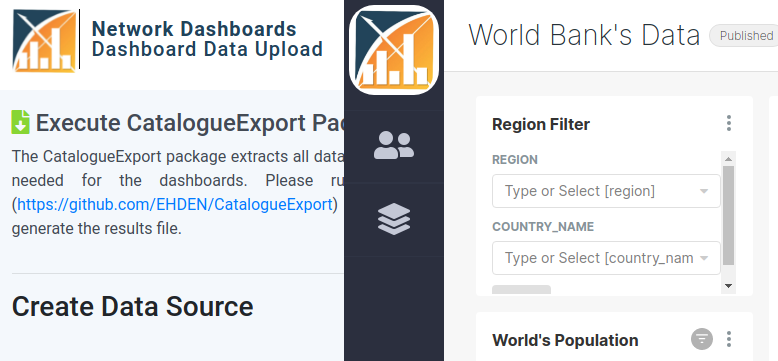
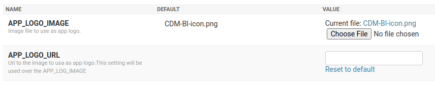
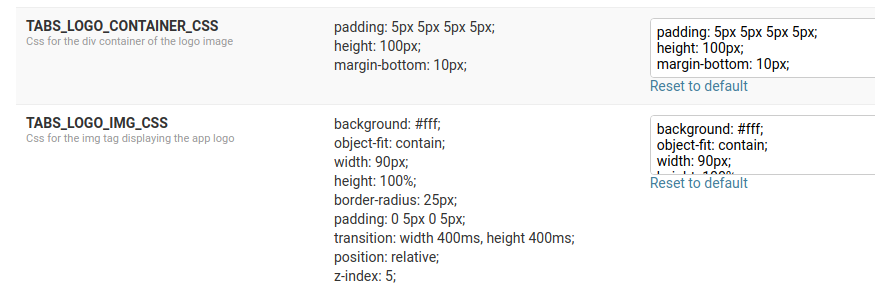
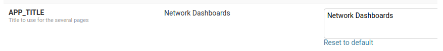
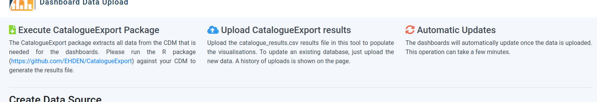
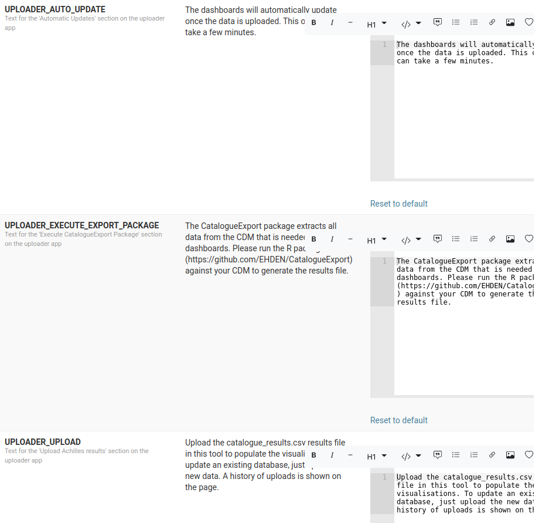
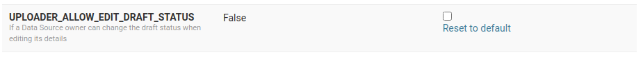
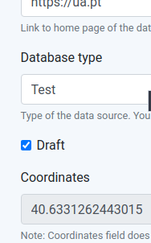

# Customizations

This platform is currently being used within the scope of the European Health Data & Evidence Network ([EHDEN](https://www.ehden.eu/)) project.
To allow the dashboard viewer Django application to be easily used by another project or company, several components support customization in runtime, removing the need to change such things directly on the source code.

To achieve this we make use of [Constance](https://github.com/jazzband/django-constance) that allows configuring several fields which then can be changed through the Django admin app.

### Platform Logo {-}

It is visible both in the Tabs Manager and the Catalogue Results Uploader URLs.

The platform allows two possible ways to choose a logo: upload a file or provide an URL to an image.

If both fields are provided, the URL one will be used.

On the tabs manager app, we also allow customization of the CSS associated both with the image itself and its container.

### Platform Title {-}

All pages of the uploader app use the same base HTML file which contains a header with the platform logo, page title, and platform title.

The first was already mentioned before, the second can't be changed.
The last can be altered using a Constance field.

### Uploader Page Texts {-}

The data source creation page has three columns with some text providing some instructions for the creation of a data source and the upload of catalogue results.

The text of these three columns is customizable, where [markdown](https://www.markdownguide.org/) can be used, which is then transformed into HTML before rending the page.

### Allow Draft Status Updates {-}

In the section [Draft Status](processes.html#draft-status) of the Processes chapter, it was already explained the concept around draft data sources.

By default, a user can NOT change the data source status on the edit page of a data source, only being allowed to do it through a PATCH request.
Changes through the web edit form can be allowed by changing a Constance field.

Them an additional draft field will be available on the edit data source form.

