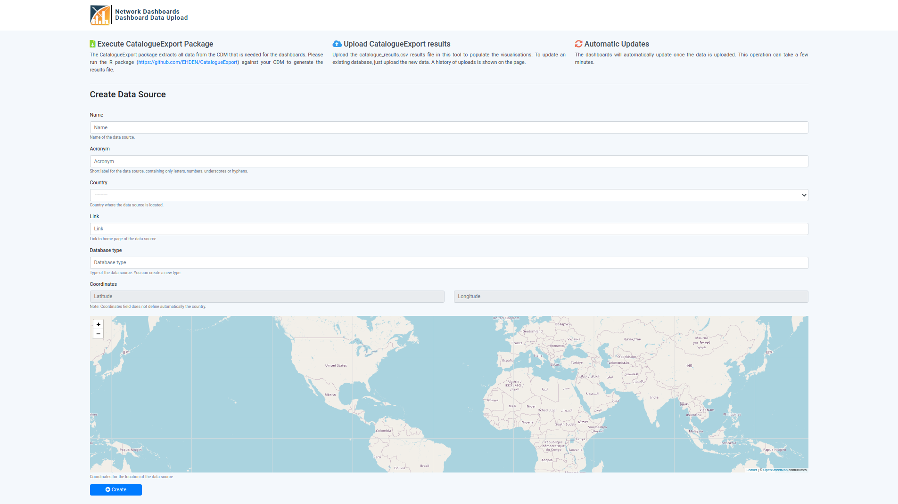
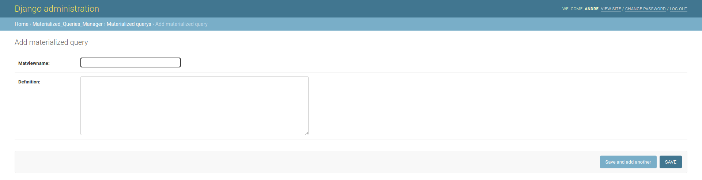
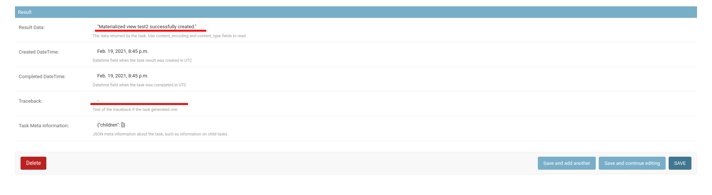
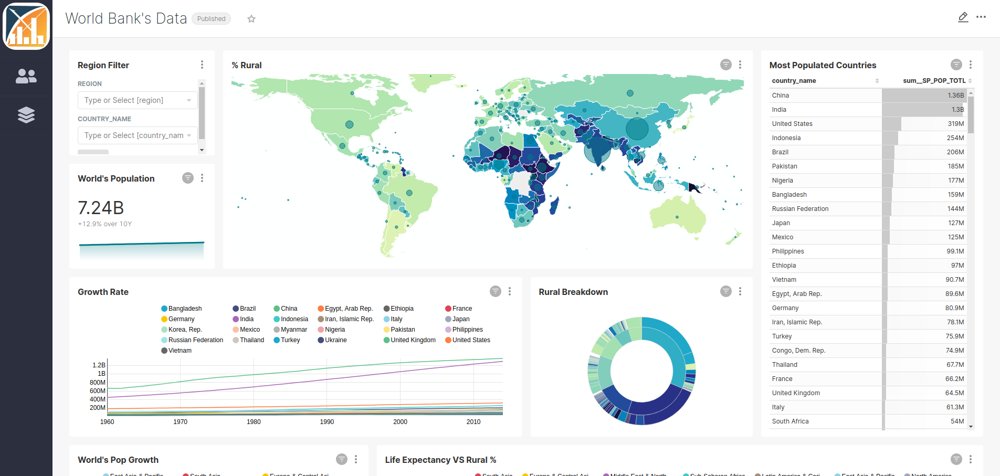
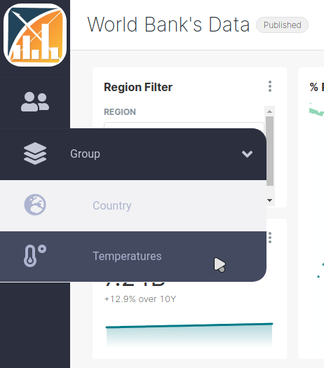

# Processes

### Data Sources {-}

**Target: platform user**

Before uploading any data to this platform, a data source owner has to create a data source instance to then associated the upload data with.

The creation of data source is done through the `[BASE_URL]/uploader/` URL, where 7 fields are expected:

1. name: an extensive name
2. acronym: a short name
3. country: where is the data source localized
4. link (Optional): web page of the data source
5. database type: type of OMOP database
6. coordinates: a more accurate representation of the data source's localization
7. hash (Optional): the internal unique identifier of a data source

If you access `[BASE_URL]/uploader/` the 7th field (hash) is set automatically for something random, however, if you want to set it use the `[BASE_URL]/uploader/[HASH]/` URL.

To avoid duplication on the database type field, this field is transformed (use title case and trimmed) and then is checked there is already a record (Database Type) with the same value.

There are several ways to create a data source:

1. Create through a web form

By accessing the `[BASE_URL]/uploader/` URL, you will get a form where you can field the fields, where the country field is a dropdown and the coordinates field is set through a map widget.

2. Automatically create when performing a GET to the `[BASE_URL]/uploader/` URL

If the Network Dashboards platform is being used as a third-party application and the main application has all the data for the required fields, the data source can be automatically created and the user is redirected directly to the upload files page.

To perform this, each field should be provided as a URL parameter when accessing the `[BASE_URL]/uploader/` URL. If all required fields are provided and are valid the data source is created and the user is redirected to the upload files page. If a required field is missing or is not valid the webform is presented to the user so it can manually fill those fields.

3. Automatically create by performing a POST to the `[BASE_URL]/uploader/` URL

Since the creation URL does not have csrf cookie protection, you can perform a POST request as you were submitting a form.

**Notes For the automatic options**:

- Since the coordinates field is composed of two fields (latitude, longitude), it should be submitted as `coordinates_0=[latitude]` and `coordinates_1=[longitude]`

- The country field should match one of the available on the dropdown of the webform.

#### Draft Status {-}

asdf

### Catalogue Results Files {-}

**Target: platform user**

Once a data source is created you can access its upload page by accessing the `[BASE_URL]/uploader/[HASH]/`. If no data source has the provided hash you will be redirected back to the data source creation form.

On the upload page you can:

1. Go to the edit page of your data source
2. Upload a catalogue results file
3. Check the upload history

A catalogue results file is a CSV file, the result obtained after running the [EHDEN/CatalogueExport](https://github.com/EHDEN/CatalogueExport) R package on an OMOP database. It is a variant of the [OHDSI/Achilles](https://github.com/OHDSI/Achilles) where it only extracts a subset of analyses of the ACHILLES' original set.

The upload form expects a CSV file with the following columns:

| Name         | Type   | Required/Non-Nullable/Non-Empty |
| ------------ | ------ | ------------------------------- |
| analysis_id  | int    | Yes                             |
| stratum_1    | string | No                              |
| stratum_2    | string | No                              |
| stratum_3    | string | No                              |
| stratum_4    | string | No                              |
| stratum_5    | string | No                              |
| count_value  | int    | Yes                             |
| min_value    | double | No                              |
| max_value    | double | No                              |
| avg_value    | double | No                              |
| stdev_value  | double | No                              |
| median_value | double | No                              |
| p10_value    | double | No                              |
| p25_value    | double | No                              |
| p75_value    | double | No                              |
| p90_value    | double | No                              |

The uploaded file must:

- either contain the first 7 columns OR all 16 columns

- contain the columns in the same order as presented in the table above

While parsing the uploaded file, some data is extracted to then present on the Upload history and to update data source information. This data is extracted from the record with analysis id 0, **which is required to be present on the file**, and 5000, which is optional. Next is presented the data extracted and their description:

- R Package Version: the version of CatalogueExport R package used

- Generation Date: date at which the CatalogueExport was executed on the OMOP database

- Source Release Date: date at which the OMOP database was released

- CDM Release Date: date at which the used CDM version was released

- CDM Version: version of the CDM used

- Vocabulary Version: version of the vocabulary used

The next table is presented where the previous data is stored on the rows with analysis id 0 and 5000:

| Analysis Id | Stratum 1 | Stratum 2           | Stratum 3        | Stratum 4   | Stratum 5          |
| ----------- | --------- | ------------------- | ---------------- | ----------- | ------------------ |
| 0           |           | R Package Version   | Generation Date  |             |                    |
| 5000        |           | Source Release Date | CDM Release Date | CDM Version | Vocabulary Version |

### Materialized Views {-}
**Target: admin user**

For each chart, Superset has an underlying SQL query which in our case is run every time a chart is rendered. If one of these queries takes too long to execute the charts will also take too long until they are rendered and eventually users might get timeout messages given a bad user experience.

To avoid this problem, instead of executing the raw SQL query we create a [postgres materialized view](https://www.postgresql.org/docs/10/rules-materializedviews.html) of the query, which is then used to feed the data to the chart. So only a simple `SELECT x FROM x` query is executed when a chart is rendered.

So whenever I create a chart I have to access the Postgres console? No, we created an unmanaged Materialized Queries model that maps to the materialized views on Postgres. With it you can create new materialized views through the Django admin app, by accessing the `[BASE_URL]/admin/` URL.

You have to provide the materialized view name and its query, which will then be used to execute the query `CREATE MATERIALIZED VIEW [name] AS [query]`, which will be executed on a background task so the browser doesn't hang and times out, in case of complicated queries. Taking this into account, the record associated will not appear on the Django admin app until the `CREATE MATERIALIZED VIEW` query finishes.

To give feedback on the background task we use [celery/django-celery-results](https://github.com/celery/django-celery-results), so you can check the status of a task on the Task Results model of the Celery Results app

After the creation of a Materialized Query, the will be a message telling the id of the task which is executing the `CREATE MATERIALIZED VIEW` query. You can then check for the record associated with the task, click on the id to get more details. If something went wrong check the error message either on Result Data or Traceback fields under the Result section

After all this, the final step is to add the materialized view as a Dataset. Login into Superset, then go to Data -> Datasets and create a new one. Select the `Achilles` database, the `public` schema, then the created materialized view and click "ADD". After this, the materialized view can be used as a data source for a new chart.

### Tabs View [Deprecated] {-}

Note: This app is no longer maintaned and the associated urls were unlinked.

**Target: admin user**

Once there are data sources on the platform, data was uploaded to them and there are dashboards created on Superset, researchers can now browse through the dashboards and analyze and compare the data of the different data sources.
One way to allow this would be to let them browse through the dashboard list on Superset. However, if there was some dashboards not ready to show to the public users, they could still access them.

For that, it was created a page, with a sidebar, where public users could browse through the available and ready dashboards.
It can be accessed through the URL `[BASE_URL]/tabs/`

The sidebar entries can be configured through the Django admin app, accessing the Tabsmanager app section.
Here two models are available to create:

- Tab Groups: They allow to groups several sidebar entries within a collapsable group.

- Tabs: Will create a clickable entry on the sidebar that can be presented within a group. When a tab is clicked the associated dashboard will be displayed on the page.

Each entry, tab, or group of them, expects:

- Title/Name
- Icon: Name of a font awesome version 5 icon
- Position: Allows to order entries along the sidebar. If a Tab has a group, then this field will order the tabs within that group only.
- Visible: If whether or not this tab or group should be visible. The goal of this field is to avoid having to delete the record from the database just because a certain tab is not ready and later on created it from scratch.

Tabs additionally expect an URL, which will be used to display a Superset dashboard in an iframe.
To hide Superset's menu bar, an additional `standalone` URL parameter should be appended to the provided URL of a tab.
The value of the `standalone` arguments depends on the expected result:

- 1: menu bar is hidden. the bar where the dashboard title, publish status, and three dots option menu are present will still appear
- 2: both the menu bar and the dashboard title bar are hidden.

By default, the dashboard of the first tab is displayed on the page, however, if one wants a specific tab to be displayed when the page is opened, its title should be present in the hash part of the URL.
For example, if there is a tab called People, to make that tab selected at the start the following URL should be used `[BASE_URL]/tabs/#People`. 
