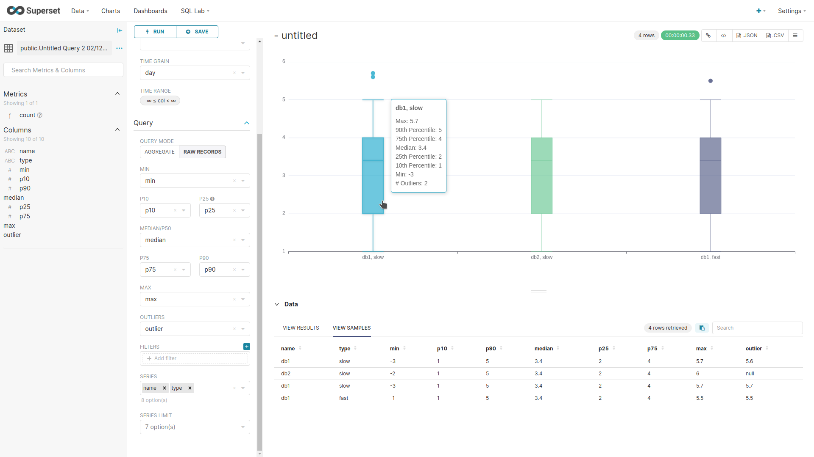

## @superset-ui/plugin-chart-box-plot

Box Plot Chart with a raw mode. Based on the Box Plot present [here](https://github.com/apache-superset/superset-ui/tree/v0.17.10/plugins/plugin-chart-echarts)

[](https://www.npmjs.com/package/@superset-ui/plugin-chart-echarts)
[](https://david-dm.org/apache-superset/superset-ui?path=packages/superset-ui-plugin-chart-echarts)

This plugin provides Echarts viz plugins for Superset:

- Box Plot Chart

### How to update

1. Check what release version of the `@superset-ui/plugin-chart-echarts` npm plugin, superset is using (see the file at `superset-frontend/package.json`).

2. If it is greater than 0.17.10, go to the [history](https://github.com/apache-superset/superset-ui/commits/master/plugins/plugin-chart-echarts) of commits done to the plugin-chart-echarts plugin of the superset-ui repository and update to the most recent commit that has the same version that is being used by your superset version. A fast way check the changes done between two commits: `git diff [old_commit_hash] [recent_commit_hash] -- plugins/plugin-chart-echarts`

### Demo



Note the Data section:
- Multiple column series are supported. Their value is then concatenated by adding `", "` between them.
- Columns Min, P10, P25, Median, P75, P90 and Max are mandatory.
- To add several outliers to the same box, you must have several rows with the same data but with different outlier values.

### Usage

Configure `key`, which can be any `string`, and register the plugin. This `key` will be used to
lookup this chart throughout the app.

```js
import {
  EchartsBoxPlotChartPlugin,
} from '@superset-ui/plugin-chart-box-plot';

new EchartsBoxPlotChartPlugin().configure({ key: 'box_plot' }).register();
```

Then use it via `SuperChart`. See
[storybook](https://apache-superset.github.io/superset-ui/?selectedKind=chart-plugins-plugin-chart-echarts)
for more details.

```js
<SuperChart
  chartType="echarts-ts"
  width={600}
  height={600}
  formData={...}
  queriesData={[{
    data: {...},
  }]}
/>
```
